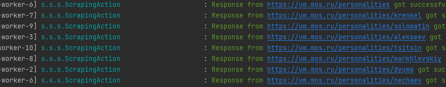
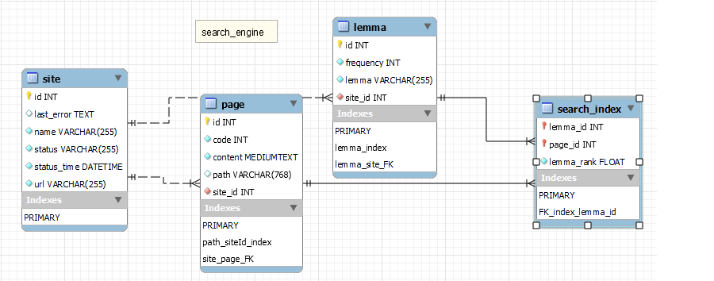
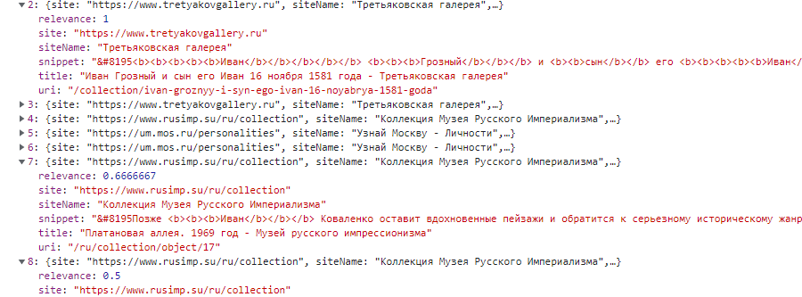
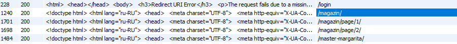
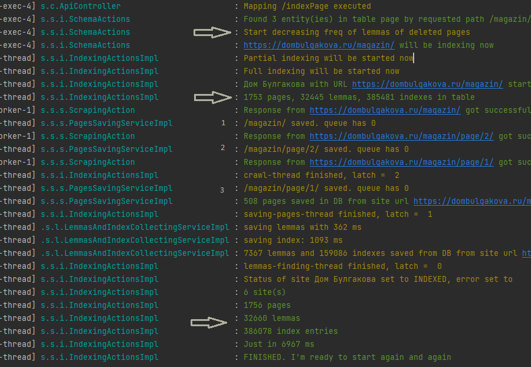

# «Поисковый движок»
### Итоговый проект курса "Java-разработчик с нуля"

#### Проект имеет целью создание эффективного и быстрого поискового решения, которое будет использоваться для индексации и поиска информации в различных Internet источниках.

---

## Описание

Весь проект условно можно разделить на две части:
- рутина: парсинг ссылок, поиск лемм, и создание поискового индекса;
- статистика содержимого базы данных
- поиск: алгоритм выборки данных и создание сниппетов, которые будут отражать суть поискового запроса.
 
Первая часть самая объемная, ресурсоемкая. От верного выполнения которой зависит качество поиска.

---
### Парсинг

Эта часть проекта базируется на рекурсивном обходе сайта: На вход первого потока подаем ссылку на сайт,
собираем все валидные ссылки со страницы, исключая редиректы, и вызываем новую задачу по каждой найденной ссылке.

По каждой ссылке получается вся необходимая в дальнейшем информаций: содержимое, HTTP - ответ, тип контента.
На этой основе создается сущность PageEntity, которая кладется в очередь LinkedBlockingQueue.

---
### Сохранение страниц
Поток отвечающий за сохранение страниц берет из очереди сущность, если она там есть, если нет - ждем, выполняет проверку на наличие записи в базе с таким же path, и если проверка прошла - сохраняет.

---
### Лемматизация и создание поискового индекса
Следующим этапом является создание баз нормальных форм слов из содержимого страниц и создание поискового индекса: записей в базе по каждой лемме на каждой странице.
Этот поток берет id страницы, который в очередь добавил предыдущий поток
Лемматизация построена на Русской морфологии для Java и фреймворка Apache Lucene/

Сохранение происходит последовательно: сначала заканчивается лемматизация всех страниц, сохраняются все сущности, затем сохраняется весь индекс.
Эта последовательность нужна для того, что сущность индекс имеет составной ключ, и является таблицей связи Многие-ко-Многим для PageEntity - LemmaEntity

---
### Статистика
Статистика отображает кол-во проиндексированных сайтов, возможные ошибки индексации, общее кол-во лемм и страниц

---
### Поиск

Результаты выводятся в порядке убывания релевантности содержимого

Алгоритм поиска следующий:
+ Лемматизируется контент страницы с созданием таблицы Позиция - Лемма
+ Создается временная "грязная" таблица Позиция - "Грязное" слово (из поискового запроса)
+ Сортируется таблица по возрастанию позиций
+ В цикле по таблице заходим по каждой позиции 
+ + запоминаем участок текста
+ + заходим по следующей позиции
+ + если между искомыми леммами небольшая разница по позициям, то расширяем границу первого сниппета
+ + и так по каждой позиции
+ Eсли между пред. и послед. позициями расстояние, которое лучше разбить на два сниппета
+ + предыдущий сохраняется в итоговую таблицу
+ + последующий еще остается в обработке, возможно его придется расширить.

+ Далее проходим по итоговой таблице для выделения жирным тэгом искомых слов, и запоминаем сколько искомых слов в сниппете.
+ Сортируем по убыванию таблицу
+ Возвращаем

---

## Использованные технологии

- Java
- MySQL
- Spring Boot
- Apache Lucene
- HTML и JavaScript

---

## Для того, чтобы запустить проект...

+ Нужно создать базу MySQL и указать параметры подключения в **application.yaml**
+ Иметь установленный JDK

---
## Отдельная опция проекта - индексация отдельной страницы

Ее можно запустить по любой ссылке на сайт, присутствующий в конфигурационном файле
#### Алгоритм следующий
+ Из базы удаляются страница - источник и все страницы, содержащие в __path__ полный путь страницы - источника.
+ Дальше **уменьшается** частота лемм, которые найдены были на этих страницах
+ Удаляется индекс по этим страницам

